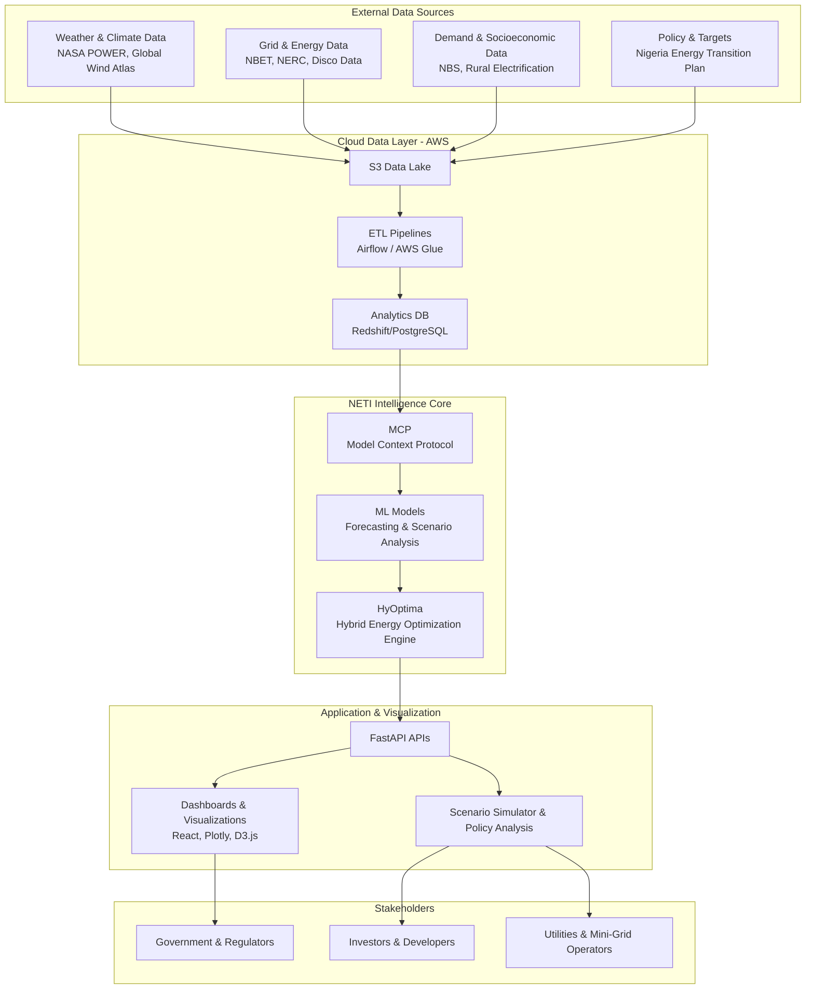

# NETI-HyOptima: Comprehensive Project Documentation

## A Reference Guide for Development, Collaboration, and AI-Assisted Implementation

---

## Executive Summary

**NETI-HyOptima** (Nigeria Energy Transition Intelligence Platform) is a cloud-native decision intelligence platform designed to convert Nigeria's Energy Transition Plan (ETP) into actionable, bankable investment decisions. It is not a dashboard, not a forecasting tool, and not an academic model. It is a **computational policy environment** that bridges the gap between policy ambition and operational reality.

### Core Identity Statement

> NETI-HyOptima is a decision intelligence platform for Nigeria's energy transition. The platform integrates machine learning for demand and renewable forecasting, operations research for hybrid energy optimization, and simulation for uncertainty analysis. At its core is the HyOptima engine, which optimizes energy systems across cost, emissions, and reliability dimensions under Nigeria's Energy Transition Plan constraints. An agentic execution layer, enabled by the Model Context Protocol, allows policymakers and operators to interact with complex optimization models using natural language, bridging the gap between policy ambition and operational reality.

---

## Part I: Vision, Problem, and Solution

### 1. Vision

Nigeria is at a pivotal moment in its energy transition. Despite ambitious policies and targets under the Nigeria Energy Transition Plan (ETP) 2022 with a 2060 net-zero goal, **execution intelligence** - the ability to convert policy into actionable, optimized energy decisions - is missing.

NETI-HyOptima bridges this gap by:

- Demonstrating how gas can be effectively used as a transition fuel
- Integrating renewables with storage for reliability
- Optimizing hybrid energy systems to reduce cost, emissions, and improve reliability
- Providing evidence-based, actionable insights for policymakers, utilities, investors, and developers

### 2. The Problem

Stakeholders in Nigeria's energy landscape face complex, interconnected challenges:

| Challenge                        | Description                                                                   |
| -------------------------------- | ----------------------------------------------------------------------------- |
| **Intermittency of Renewables**  | Solar and wind variability makes planning difficult                           |
| **Grid Instability**             | Frequent outages and limited capacity create operational uncertainty          |
| **High Cost and Emission Risks** | Fossil-fuel generation is expensive and carbon-intensive                      |
| **Unclear Transition Pathways**  | ETP sets targets but provides limited actionable guidance                     |
| **Data Fragmentation**           | Operational, demand, and climate data are siloed, inconsistent, or incomplete |

**The Critical Gap**: Policy exists, execution intelligence does not. Decision-makers need a system that translates policy and data into optimized, cost-effective, and sustainable energy operations.

### 3. The Solution

NETI-HyOptima is an end-to-end decision intelligence platform integrating:

| Component                        | Role                                                                                          |
| -------------------------------- | --------------------------------------------------------------------------------------------- |
| **Machine Learning (ML)**        | Forecast demand and renewable generation using time-series models (LSTM, Prophet, XGBoost)    |
| **Operations Research (OR)**     | Solve hybrid energy dispatch and investment optimization via MILP and stochastic optimization |
| **Simulation**                   | Monte Carlo and scenario-based simulations for uncertainty analysis                           |
| **Cloud Infrastructure**         | Scalable deployment of data pipelines, models, and APIs on AWS                                |
| **Model Context Protocol (MCP)** | Ensures contextual consistency, interoperability, and explainable decision outputs            |

The platform focuses on **bankability** and **operational efficiency**: minimizing Levelized Cost of Energy (LCOE), optimizing CAPEX and OPEX, and supporting evidence-based investment decisions.

---

## Part II: System Architecture

### 4. Unified System Identity

NETI-HyOptima operates as **one coherent flagship system** with three internal subsystems:

```
NETI-HyOptima (The Platform)
    |
    +-- HyOptima Core Engine (The Brain)
    |       - Hybrid energy dispatch optimization
    |       - Capacity expansion planning
    |       - Cost-emissions-reliability trade-offs
    |       - Gas as transition fuel modeling
    |       - MILP + stochastic optimization
    |
    +-- NEXUS Layer (Agentic Execution Interface)
    |       - MCP-based agent interface
    |       - Natural-language to optimization
    |       - Policy-aware scenario execution
    |       - Human-in-the-loop explanations
    |
    +-- Decision & Policy Intelligence Layer
            - Alignment with Nigeria ETP
            - Long-term (2030-2060) scenario analysis
            - Investment pathways
            - Policy stress testing
```

### 5. Five-Layer Architecture

```
+------------------------------------------------------------------+
|                    L5: STAKEHOLDERS                               |
|  Government & Regulators | Investors & Developers | Utilities     |
+------------------------------------------------------------------+
                              ^
                              |
+------------------------------------------------------------------+
|              L4: APPLICATION & VISUALIZATION LAYER                |
|  FastAPI APIs | Dashboards (React/Plotly/D3) | Scenario Simulator |
+------------------------------------------------------------------+
                              ^
                              |
+------------------------------------------------------------------+
|                  L3: NETI INTELLIGENCE CORE                       |
|  MCP (Model Context Protocol) | ML Models | HyOptima Engine       |
+------------------------------------------------------------------+
                              ^
                              |
+------------------------------------------------------------------+
|                    L2: CLOUD DATA LAYER (AWS)                     |
|  S3 Data Lake | ETL Pipelines (Airflow/Glue) | Analytics DB       |
+------------------------------------------------------------------+
                              ^
                              |
+------------------------------------------------------------------+
|                   L1: EXTERNAL DATA SOURCES                       |
|  Weather | Grid Data | Demand Data | Policy Documents            |
+------------------------------------------------------------------+
```

### 6. Architecture Diagram (Mermaid)



---

## Part III: Mathematical Foundation

### 7. HyOptima Core Mathematical Model

#### 7.1 Problem Statement

We are solving a **hybrid energy system optimization problem** for Nigeria's energy transition. At each time period, the system must decide:

- How much power to generate from gas, diesel, solar, wind
- How to charge/discharge batteries
- How much to import from the grid

While:
- Meeting electricity demand
- Minimizing cost and emissions
- Respecting technical and policy constraints

This is a **multi-objective, constrained optimization problem with uncertainty**.

#### 7.2 Sets and Indices

| Symbol            | Description                             |
| ----------------- | --------------------------------------- |
| t \in T           | Time periods (hourly or daily)          |
| g \in G           | Dispatchable generators (gas, diesel)   |
| r \in R           | Renewable sources (solar, wind)         |
| s \in S           | Storage systems (batteries)             |
| \omega \in \Omega | Uncertainty scenarios (weather, demand) |

#### 7.3 Parameters (Inputs)

**Demand & Forecasts:**
- D_{t,\omega}: Electricity demand at time t under scenario \omega

**Generation Capacities:**
- \bar{P}_g: Max output of generator g
- \bar{P}_r: Installed capacity of renewable r

**Renewable Availability:**
- \alpha_{r,t,\omega} \in [0,1]: Availability factor (from ML forecasts)

**Costs:**
- C^{fuel}_g: Fuel cost per kWh for generator g
- C^{start}_g: Startup cost for generator g
- C^{grid}_t: Grid tariff
- C^{storage}: Degradation cost per kWh cycled

**Emissions:**
- E_g: CO2 emission factor (kg CO2/kWh) for generator g

**Storage:**
- \bar{SOC}_s: Max storage capacity
- \eta^{ch}_s, \eta^{dis}_s: Charge/discharge efficiency

**Policy:**
- \bar{E}: Emission cap (from Nigeria ETP)
- \rho_r: Minimum renewable penetration target

#### 7.4 Decision Variables

**Power Dispatch:**
- P_{g,t,\omega} \geq 0: Power from generator g
- P_{r,t,\omega} \geq 0: Power from renewable r
- P^{grid}_{t,\omega} \geq 0: Grid import

**Storage:**
- P^{ch}_{s,t,\omega} \geq 0: Charging power
- P^{dis}_{s,t,\omega} \geq 0: Discharging power
- SOC_{s,t,\omega}: State of charge

**Binary Decisions (MILP):**
- y_{g,t,\omega} \in {0,1}: Generator on/off status

#### 7.5 Objective Functions

**Objective 1: Minimize Total System Cost**
```
min \sum_{\omega \in \Omega} p_\omega \sum_{t \in T} (
    \sum_{g \in G} C^{fuel}_g P_{g,t,\omega} +
    \sum_{g \in G} C^{start}_g y_{g,t,\omega} +
    C^{grid}_t P^{grid}_{t,\omega} +
    \sum_{s \in S} C^{storage} (P^{ch}_{s,t,\omega} + P^{dis}_{s,t,\omega})
)
```

**Objective 2: Minimize Carbon Emissions**
```
min \sum_{\omega \in \Omega} p_\omega \sum_{t \in T} \sum_{g \in G} E_g P_{g,t,\omega}
```

**Scalarized Version (Used in Practice):**
```
min w_1 \cdot Cost + w_2 \cdot Emissions + w_3 \cdot UnservedEnergy
```
Weights w_1, w_2, w_3 are policy-controlled.

#### 7.6 Constraints

**Power Balance (Core Constraint):**
```
\sum_{g \in G} P_{g,t,\omega} + 
\sum_{r \in R} P_{r,t,\omega} + 
\sum_{s \in S} P^{dis}_{s,t,\omega} + 
P^{grid}_{t,\omega} = 
D_{t,\omega} + 
\sum_{s \in S} P^{ch}_{s,t,\omega}
\forall t, \omega
```

**Generator Limits:**
```
0 \leq P_{g,t,\omega} \leq \bar{P}_g \cdot y_{g,t,\omega}
```

**Renewable Availability:**
```
0 \leq P_{r,t,\omega} \leq \alpha_{r,t,\omega} \cdot \bar{P}_r
```

**Storage Dynamics:**
```
SOC_{s,t,\omega} = SOC_{s,t-1,\omega} + \eta^{ch}_s P^{ch}_{s,t,\omega} - \frac{1}{\eta^{dis}_s} P^{dis}_{s,t,\omega}
0 \leq SOC_{s,t,\omega} \leq \bar{SOC}_s
```

**Emission Cap (ETP-aligned):**
```
\sum_{t,g} E_g P_{g,t,\omega} \leq \bar{E} \forall \omega
```

**Renewable Penetration Target:**
```
\frac{\sum_{t,r} P_{r,t,\omega}}{\sum_t D_{t,\omega}} \geq \rho_r
```

---

## Part IV: Technical Implementation

### 8. Technology Stack

| Layer                              | Technologies                                          |
| ---------------------------------- | ----------------------------------------------------- |
| **Cloud Infrastructure**           | AWS (S3, EC2, Lambda, Glue, Step Functions, Redshift) |
| **Backend**                        | Python, FastAPI, Pyomo, PuLP, OR-Tools, HiGHS solver  |
| **Frontend**                       | React / Next.js, Plotly, D3.js, Mapbox                |
| **Machine Learning**               | Scikit-learn, XGBoost, TensorFlow / PyTorch           |
| **Data Orchestration**             | Apache Airflow, n8n                                   |
| **Integration & Interoperability** | MCP (Model Context Protocol)                          |
| **Database**                       | PostgreSQL (operational), Redshift (analytical)       |
| **Storage**                        | S3 (data lake, large artifacts)                       |

### 9. Repository Structure

```
neti-hyoptima/
|
+-- README.md
+-- requirements.txt
+-- .gitignore
|
+-- notebooks/                     # Exploration & experiments
|   +-- phase1_core_model.ipynb
|   +-- phase2_simulation.ipynb
|   +-- data_exploration.ipynb
|
+-- data/
|   +-- raw/                       # Untouched datasets
|   +-- processed/                 # Cleaned inputs
|   +-- synthetic/                 # Generated test data
|
+-- hyoptima/                      # THE ACTUAL ENGINE
|   +-- __init__.py
|   +-- model.py                   # Pyomo model definition
|   +-- parameters.py              # Economic + tech assumptions
|   +-- profiles.py                # Load & solar generation
|   +-- solver.py                  # Run optimization
|   +-- utils.py                   # Helper functions
|
+-- mcp_nexus/                     # Agentic layer (Phase 2+)
|   +-- __init__.py
|   +-- context.py                 # MCP context management
|   +-- interpreter.py             # Natural language to model
|
+-- api/                           # Backend services (Phase 4+)
|   +-- __init__.py
|   +-- main.py                    # FastAPI application
|   +-- routes/
|   +-- models/
|
+-- results/
|   +-- figures/
|   +-- runs/
|
+-- docs/
|   +-- phase1_notes.md
|   +-- mathematical_derivation.md
|   +-- data_sources.md
|
+-- tests/
    +-- test_model.py
    +-- test_solver.py
```

### 10. Development Phases

#### Phase 1: Core Energy Model (Current)
**Goal:** One working energy optimization run in Python.

- No frontend, no database, no cloud
- Just proof the brain works
- Deliverable: Validated calculation notebook

**Steps:**
1. Define decision variables (solar capacity, gas generator size, battery size, hourly dispatch)
2. Define inputs (load profile, solar profile, fuel price, CAPEX, reliability requirement)
3. Define objective (minimize LCOE: investment + fuel + maintenance + unserved penalty)
4. Define constraints (demand balance, battery physics, gas ramp limits, emission cap)
5. Run single location scenario

#### Phase 2: Simulation Layer
**Goal:** Make the model realistic with uncertainty handling.

- Monte Carlo simulations (100-500 runs)
- Weather variability, demand growth, fuel price volatility
- Output ranges instead of single answers

#### Phase 3: Data Engineering Backbone
**Goal:** Connect real data sources.

- Pipelines for weather, demand, cost curves, policy targets
- Store raw \to clean \to feature tables
- Automated weekly scenario computation

#### Phase 4: Backend API
**Goal:** Expose the engine as services.

- Endpoints: run scenario, get results, compare scenarios, policy alignment score
- Orchestrate workers running the optimizer
- Event-driven architecture

#### Phase 5: Policy Intelligence Layer
**Goal:** Encode national targets into machine rules.

- Alignment score calculation
- Capacity gap analysis
- Investment gap analysis
- Emission pathway deviation tracking

#### Phase 6: Frontend (Decision Studio)
**Goal:** Build the user interface.

- Scenario Builder
- Run Monitor
- Results Explorer
- Policy Comparison
- Explainability Panel

---

## Part V: Data Sources and APIs

### 11. External Data Sources

| Category                   | Sources                                                                 | Data Types                                  |
| -------------------------- | ----------------------------------------------------------------------- | ------------------------------------------- |
| **Weather & Climate**      | NASA POWER, Global Wind Atlas, NIMET                                    | Solar irradiance, wind speed, temperature   |
| **Energy & Grid**          | NBET, NERC, Disco operational datasets, World Bank Power Plant Database | Generation capacity, grid topology, outages |
| **Demand & Socioeconomic** | NBS, Nigeria SE4ALL, Rural Electrification Agency                       | Population, demand patterns, access rates   |
| **Policy & Targets**       | Nigeria Energy Transition Plan, Integrated Energy Planning Tool         | Emission targets, capacity goals, timelines |
| **Cost & Emissions**       | IEA cost curves, IPCC emission factors, IRENA                           | CAPEX, OPEX, LCOE, emission factors         |

### 12. Data Ingestion Architecture

```
External APIs/sources
        |
        v
    S3 Raw Zone (preserve original formats)
        |
        v
    ETL Pipelines (Airflow/Glue)
        |
        v
    S3 Processed Zone (analysis-ready)
        |
        v
    Feature Store / Analytics DB
        |
        v
    ML Models & Optimizer
```

---

## Part VI: Product Design Philosophy

### 13. Core Product Workflow

The platform revolves around one core workflow:

```
ingest reality -> forecast future -> optimize decisions -> simulate consequences -> explain outcome
```

**Central Entity:** Scenario \to Run \to Results \to Insights

### 14. Frontend Design: Decision Studio

The frontend is a **Decision Laboratory**, not a dashboard. Think Bloomberg Terminal meets energy planning software.

**UI Structure:**

| Component                | Purpose                                                                                  |
| ------------------------ | ---------------------------------------------------------------------------------------- |
| **Scenario Builder**     | Define location, time horizon, technology mix, assumptions                               |
| **Run Monitor**          | Stream pipeline stages: data ingestion, forecasting, optimization, simulation            |
| **Results Explorer**     | Show decisions first, then visualizations (dispatch curves, cost breakdown, sensitivity) |
| **Policy Comparison**    | Compare scenarios against national targets                                               |
| **Explainability Panel** | Answer why decisions were made (dual variables, shadow prices)                           |

### 15. Backend Design: Pipeline Orchestrator

The backend is NOT a single API. It is an **execution pipeline manager** orchestrating scientific computation.

**Core Services:**

| Service                | Role                                                                    |
| ---------------------- | ----------------------------------------------------------------------- |
| **Scenario Service**   | Store scenario definitions, validate assumptions, create run jobs       |
| **Data Service**       | Pull weather, demand, cost data; cache datasets; build feature matrices |
| **Forecast Service**   | Run demand and renewable prediction models                              |
| **HyOptima Service**   | Run Pyomo MILP, generate dispatch and capacity plans                    |
| **Simulation Service** | Monte Carlo uncertainty runs                                            |
| **Insight Service**    | Calculate LCOE, emissions, reliability; interpret shadow prices         |

**Communication Pattern:** Event-driven

```
Scenario created -> queue job
Forecast finishes -> triggers optimization
Optimization finishes -> triggers simulation
Simulation finishes -> triggers analytics
```

### 16. Database Design: Experiment Registry

The database stores **scientific experiment runs**, not just tables.

**Core Schema:**

```
users
    |
    v
scenarios (user assumptions, JSON parameters)
    |
    v
runs (execution instances, status, timestamps, version)
    |
    +-- timeseries_inputs (forecast demand & generation, hourly)
    |
    +-- optimization_outputs (dispatch results, capacity decisions)
    |
    +-- simulation_outputs (Monte Carlo distributions)
    |
    +-- metrics (LCOE, NPV, CO2, reliability)
    |
    +-- insights (binding constraints, marginal costs, explanations)
```

**Storage Strategy:**
- PostgreSQL: Metadata & metrics
- S3: Large time-series arrays and simulation outputs

---

## Part VII: Policy Intelligence Layer

### 17. Transition Tracker

The Policy Intelligence Layer answers:

- Are we aligned with national targets?
- Which sector is lagging?
- What policy variable is blocking adoption?

**Example Output:**

| Metric                    | Target     | Simulated  | Gap            |
| ------------------------- | ---------- | ---------- | -------------- |
| Solar capacity 2030       | 30 GW      | 12.4 GW    | -17.6 GW       |
| Gas transition dependence | Medium     | High       | Over-reliance  |
| Battery penetration       | On-pathway | Below      | Under-invested |
| Investment gap            | -          | $2.1B/year | Funding needed |

### 18. Computable Research Registry

Researchers contribute **structured knowledge**, not blog posts:

- Fuel price scenarios
- Technology cost curves
- Demand elasticity studies
- Carbon price pathways
- Reliability standards

All versioned and usable by the optimizer.

---

## Part VIII: Impact and Value Proposition

### 19. Multi-Dimensional Impact

| Dimension           | Impact                                                                                       |
| ------------------- | -------------------------------------------------------------------------------------------- |
| **Technical**       | Integrates ML, OR, cloud, and simulation for actionable energy insights                      |
| **Economic**        | Optimizes LCOE, CAPEX, and operational cost; supports bankable investment decisions          |
| **Environmental**   | Reduces emissions, accelerates renewable adoption, supports net-zero targets                 |
| **Policy & Social** | Translates ETP into evidence-based actions; improves rural electrification and energy access |

### 20. Why This Is a Flagship Portfolio Project

- **Research-ready**: Rigorous mathematical foundation
- **Technically credible**: Real optimization under uncertainty
- **Policy-aligned**: Anchored to national strategic objectives
- **Systems thinking**: ML + OR + simulation + cloud integration
- **Domain fluency**: Energy transition, gas as bridge fuel, bankability focus

---

## Part IX: Implementation Roadmap

### 21. Phase 1 Implementation Details

**Environment:** Google Colab or local Python 3.11

**Core Libraries:**
- NumPy (numeric operations)
- Pandas (time series handling)
- Matplotlib (result visualization)
- Pyomo (optimization modeling)
- HiGHS or CBC solver (MILP solving)

**HyOptima v0 Model:**

```python
# Decision Variables (Sizing)
solar_capacity (kW)
gas_generator_capacity (kW)
battery_capacity (kWh)

# Decision Variables (Operational, per hour t)
solar_energy_used[t]
gas_energy_generated[t]
battery_charge[t]
battery_discharge[t]
unserved_energy[t]

# Inputs
load_profile[24]  # hourly demand
solar_profile[24]  # normalized irradiance
solar_capex ($/kW)
gas_capex ($/kW)
battery_capex ($/kWh)
gas_fuel_cost ($/kWh)
blackout_penalty ($/kWh lost)

# Objective
minimize: investment_cost + fuel_cost + penalty_cost

# Constraints
energy_balance[t]: solar + gas + discharge - charge + unserved = demand
solar_limit[t]: solar_used <= solar_capacity * solar_profile[t]
gas_limit[t]: gas_generated <= gas_capacity
battery_soc[t]: SOC[t] = SOC[t-1] + charge*eff - discharge/eff
soc_limit[t]: 0 <= SOC[t] <= battery_capacity
reliability: sum(unserved) <= tolerance
```

**Expected Output:**
- Optimal solar size (kW)
- Optimal gas size (kW)
- Optimal battery size (kWh)
- Total system cost ($)
- Hourly dispatch chart

---

## Part X: Key Files to Create

### 22. Immediate Next Steps

1. **Create repository structure** (hyoptima/, data/, notebooks/, docs/, results/)
2. **Create requirements.txt** with core dependencies
3. **Create hyoptima/model.py** - Pyomo model definition
4. **Create hyoptima/parameters.py** - economic and technical parameters
5. **Create hyoptima/profiles.py** - load and solar generation profiles
6. **Create hyoptima/solver.py** - optimization execution
7. **Create notebooks/phase1_core_model.ipynb** - working demonstration
8. **Create docs/phase1_notes.md** - documentation

---

## Appendix A: Nigeria Energy Transition Plan Key Targets

| Sector              | Target                   | Timeline                                       |
| ------------------- | ------------------------ | ---------------------------------------------- |
| Solar systems       | 5 million+ systems       | By 2030                                        |
| Net-zero target     | Full decarbonization     | By 2060                                        |
| Investment required | $1.9 trillion            | 2022-2060                                      |
| Emission reduction  | 65% of current emissions | Power, cooking, oil & gas, transport, industry |

---

## Appendix B: Key Decision Variables for Nigeria's Transition

1. **Generation Mix Shift**: Pace of replacing diesel/petrol generators with solar PV, wind, small hydro
2. **Gas Infrastructure Investment**: Expansion of natural gas as transitional fuel
3. **Transportation Electrification Rate**: ICE to EV replacement pace
4. **Clean Cooking Transition**: Biomass to LPG/electric cooking speed
5. **Infrastructure for Future Fuels**: Grid upgrade, green hydrogen infrastructure
6. **Carbon Capture Adoption**: CCUS deployment in oil & gas operations
7. **Financing Mechanisms**: Investment scale and funding sources

---

## Appendix C: Build Order Philosophy

**Why This Order Matters:**

Energy platforms fail because they look impressive before they think correctly. We do the opposite:

```
First truth (mathematical correctness)
    |
    v
Then automation (data pipelines)
    |
    v
Then usability (APIs)
    |
    v
Then beauty (UI)
```

**The Principle:**
- Credibility comes from correct decisions
- Correct decisions come from the mathematical engine
- If you cannot manually calculate one simple scenario on paper, you cannot build the platform

---

*Document Version: 1.0*
*Last Updated: February 2026*
*Status: Ready for Implementation*